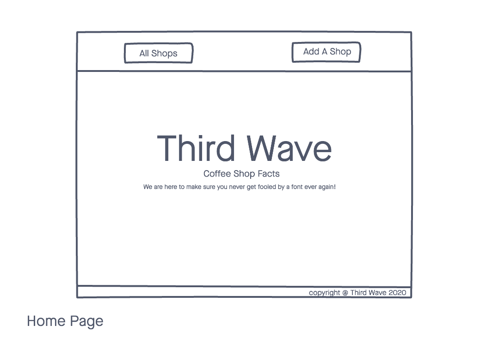
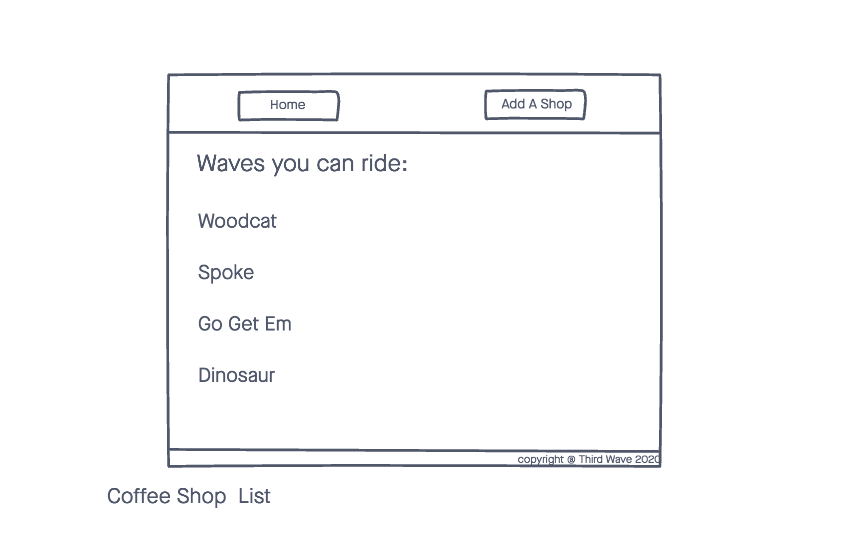
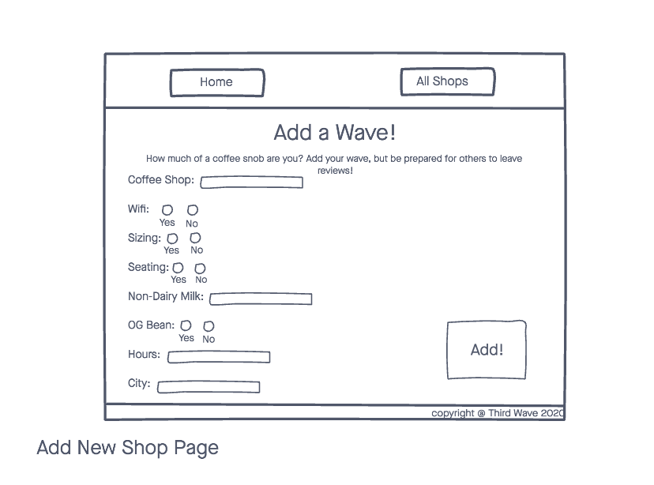
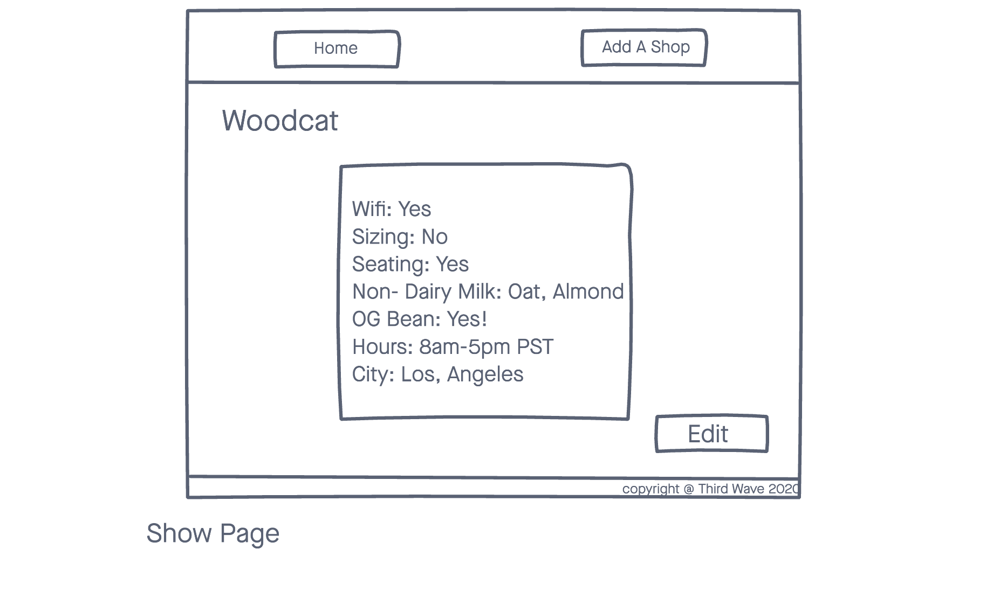
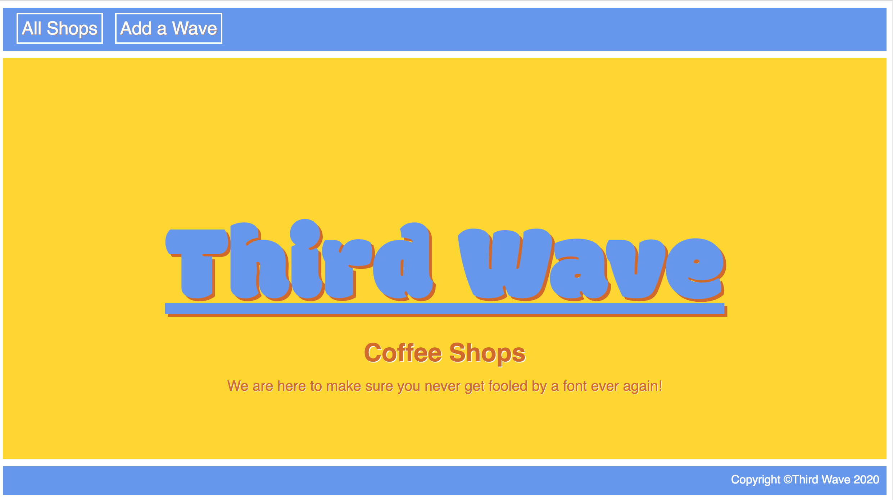
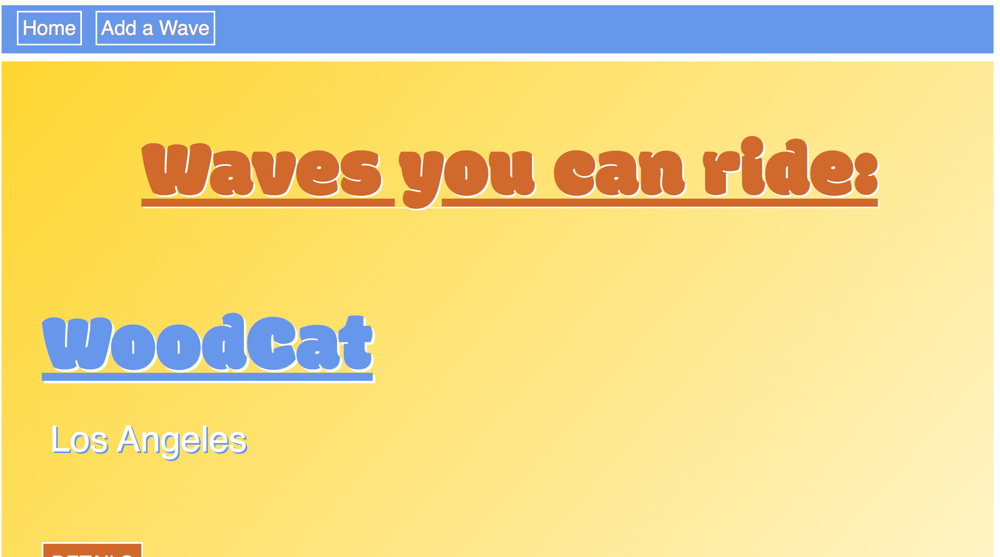
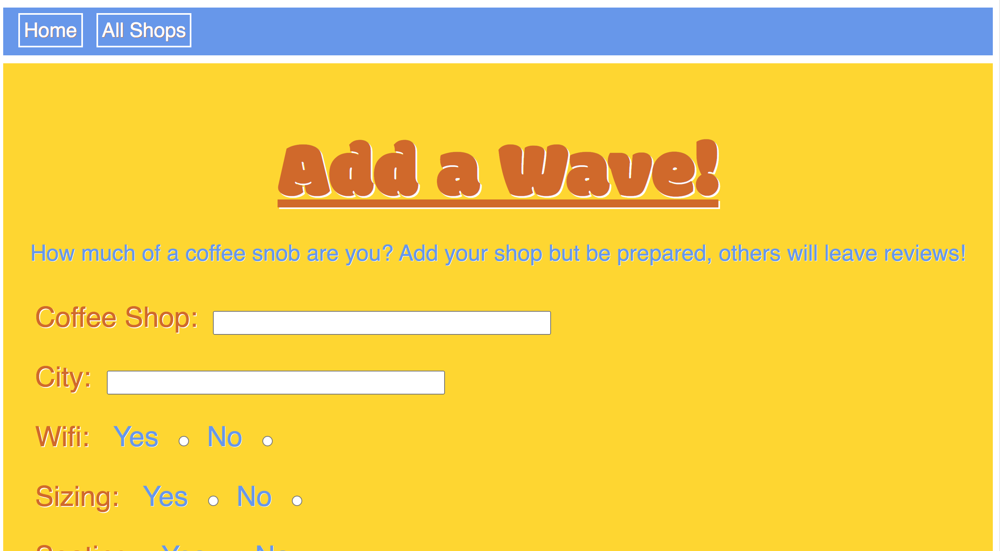
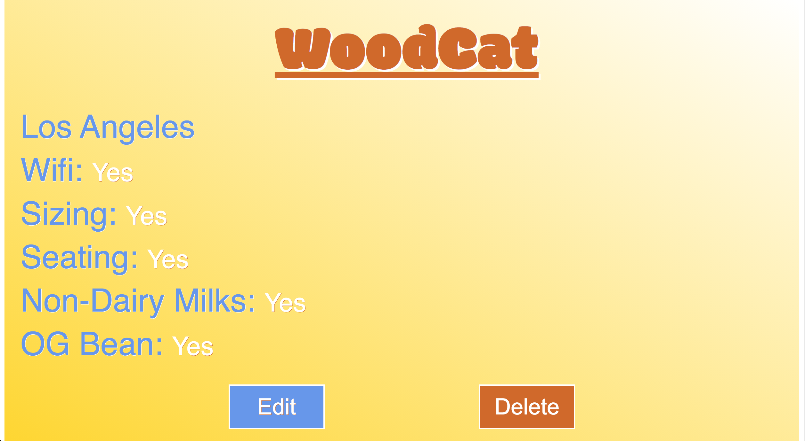

# Third Wave

 A web application that allows users to add, view and view a list of third wave coffee shops.

# Technologies Used

- HTML5
- CSS3
- JavaScript
- Google Fonts
- Express.js
- Node.js
- MongoDB
- Mongoose
- EJS

# Wireframe

# ERD

# Screenshots

# Getting Started
[Click Here](#) to see the deployed app!

# Future Enhancements

- Allow the user to sign up, login and logout

- Allow only lgged in users to add shops and reviews